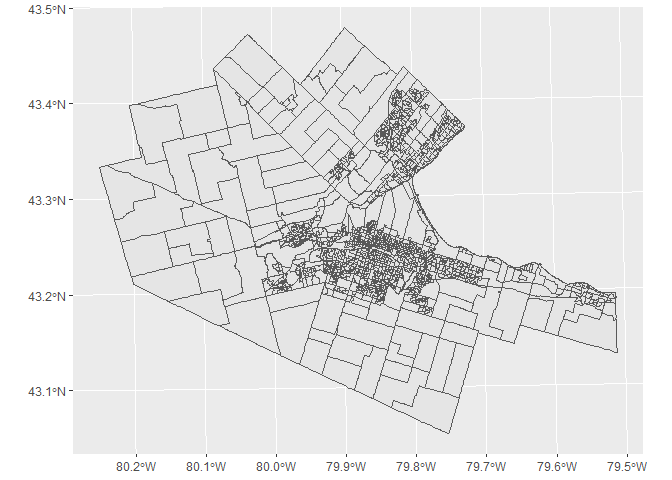
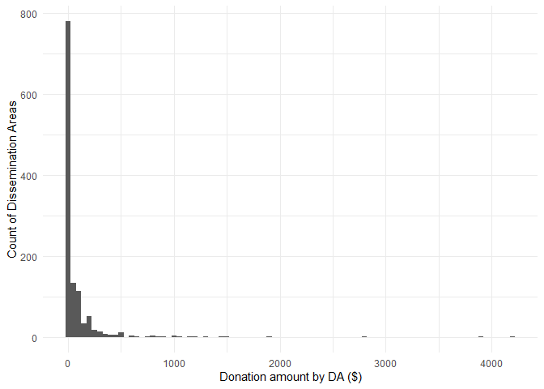
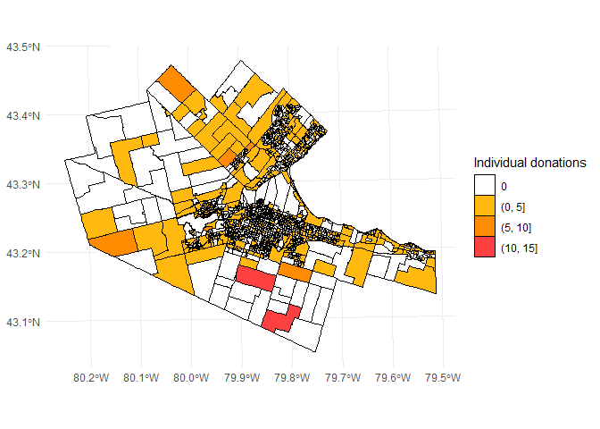
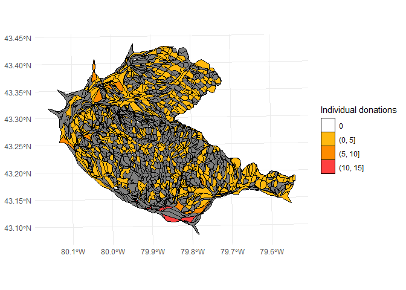
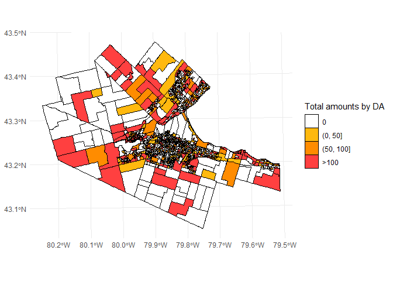

<!-- README.md is generated from README.Rmd. Please edit that file -->

# convoy-donations

<!-- badges: start -->
<!-- badges: end -->

This repository includes data and code to analyze donations made in
support to the convoy that occupied Ottawa during the winter of 2022
using the Christian crowdsourcing platform GiveSendGo.

Load packages used for the analysis:

``` r
library(cartogram)
library(tidyverse)
#> -- Attaching packages --------------------------------------- tidyverse 1.3.1 --
#> v ggplot2 3.3.5     v purrr   0.3.4
#> v tibble  3.1.6     v dplyr   1.0.7
#> v tidyr   1.1.4     v stringr 1.4.0
#> v readr   2.1.1     v forcats 0.5.1
#> -- Conflicts ------------------------------------------ tidyverse_conflicts() --
#> x dplyr::filter() masks stats::filter()
#> x dplyr::lag()    masks stats::lag()
library(sf)
#> Linking to GEOS 3.9.1, GDAL 3.2.1, PROJ 7.2.1; sf_use_s2() is TRUE
```

Read data:

``` r
load(paste0(here::here(), "/data/da_2016_p1.rda"))
load(paste0(here::here(), "/data/da_2016_p2.rda"))
da_2016 <- rbind(da_2016_p1 %>% st_sf(),
                 da_2016_p2 %>% st_sf())
```

Filter data to investigate only the Hamilton CMA (CMA_UID == “35537”):

``` r
hamilton_da_2016 <- da_2016 %>%
  filter(CMA_UID == "35537")
```

Project the geometry:

``` r
hamilton_da_2016 <- hamilton_da_2016 %>%
  st_set_crs(4326) %>%
  st_transform(crs = 26917)
```

Plot geometry:

``` r
ggplot() + 
  geom_sf(data = hamilton_da_2016)
```

<!-- -->

Create population-based cartogram:

``` r
DA_pop_cartogram <- cartogram_cont(hamilton_da_2016, 
                                   weight = "Population")
#> Mean size error for iteration 1: 7.35195588132987
#> Mean size error for iteration 2: 8.76209419708295
#> Mean size error for iteration 3: 8.74813930519746
#> Mean size error for iteration 4: 5.03660601099965
#> Mean size error for iteration 5: 4.64712102055913
#> Mean size error for iteration 6: 4.18264531730831
#> Mean size error for iteration 7: 3.17410803100323
#> Mean size error for iteration 8: 3.28379198458139
#> Mean size error for iteration 9: 3.99789051463061
#> Mean size error for iteration 10: 3.37643601672692
#> Mean size error for iteration 11: 2.20579115832604
#> Mean size error for iteration 12: 2.06446574513358
#> Mean size error for iteration 13: 2.00249861128008
#> Mean size error for iteration 14: 1.92713967181393
#> Mean size error for iteration 15: 2.50835169181768
```

Summary:

``` r
summary(hamilton_da_2016)
#>    Population       Households        GeoUID          Type     
#>  Min.   :   0.0   Min.   :   0.0   Length:1199        DA:1199  
#>  1st Qu.: 438.0   1st Qu.: 165.0   Class :character            
#>  Median : 520.0   Median : 205.0   Mode  :character            
#>  Mean   : 623.5   Mean   : 244.7                               
#>  3rd Qu.: 667.0   3rd Qu.: 268.0                               
#>  Max.   :4726.0   Max.   :1607.0                               
#>                                                                
#>     CD_UID            Shape Area         Dwellings        CSD_UID         
#>  Length:1199        Min.   : 0.00767   Min.   :   0.0   Length:1199       
#>  Class :character   1st Qu.: 0.10047   1st Qu.: 171.0   Class :character  
#>  Mode  :character   Median : 0.16324   Median : 215.0   Mode  :character  
#>                     Mean   : 1.17152   Mean   : 255.2                     
#>                     3rd Qu.: 0.31817   3rd Qu.: 283.0                     
#>                     Max.   :32.23920   Max.   :1729.0                     
#>                                                                           
#>     CT_UID            CMA_UID                   Region Name   Area (sq km)     
#>  Length:1199        Length:1199        Hamilton       :882   Min.   : 0.00767  
#>  Class :character   Class :character   Burlington     :278   1st Qu.: 0.10047  
#>  Mode  :character   Mode  :character   Grimsby        : 39   Median : 0.16324  
#>                                        105 Mile Post 2:  0   Mean   : 1.17152  
#>                                        Abbey          :  0   3rd Qu.: 0.31817  
#>                                        Abbotsford     :  0   Max.   :32.23920  
#>                                        (Other)        :  0                     
#>  v_CA16_2398: Median after-tax income of households in 2015 ($)
#>  Min.   : 10771                                                
#>  1st Qu.: 52112                                                
#>  Median : 71680                                                
#>  Mean   : 72876                                                
#>  3rd Qu.: 90368                                                
#>  Max.   :181760                                                
#>  NA's   :5                                                     
#>  v_CA16_3957: Total visible minority population   donation_n    
#>  Min.   :   0                                   Min.   : 1.000  
#>  1st Qu.:  30                                   1st Qu.: 1.000  
#>  Median :  65                                   Median : 1.000  
#>  Mean   : 109                                   Mean   : 1.654  
#>  3rd Qu.: 125                                   3rd Qu.: 2.000  
#>  Max.   :1935                                   Max.   :14.000  
#>  NA's   :4                                      NA's   :719     
#>  donation_amount           geometry   
#>  Min.   :   5.0   MULTIPOLYGON :1199  
#>  1st Qu.:  50.0   epsg:26917   :   0  
#>  Median : 100.0   +proj=utm ...:   0  
#>  Mean   : 184.9                       
#>  3rd Qu.: 200.0                       
#>  Max.   :4180.0                       
#>  NA's   :719
```

Replace NAs (donation_n and donation_amount):

``` r
hamilton_da_2016 <- hamilton_da_2016 %>%
  mutate(donation_n = replace_na(donation_n, 0),
         donation_amount = replace_na(donation_amount, 0))
```

Total amount donated by residents of Hamilton CMA:

``` r
sum(hamilton_da_2016$donation_amount)
#> [1] 88730
```

Total number of donations by residents of Hamilton CMA:

``` r
sum(hamilton_da_2016$donation_n)
#> [1] 794
```

Number of individual donations divided by population:

``` r
sum(hamilton_da_2016$donation_n)/sum(hamilton_da_2016$Population) * 100
#> [1] 0.1062143
```

Number of DAs with at least one donation:

``` r
hamilton_da_2016 %>%
  filter(donation_n != 0) %>%
  nrow()
#> [1] 480
```

Donations:

``` r
ggplot(hamilton_da_2016,
       aes(x = donation_amount)) +
  geom_histogram(binwidth = 50) + 
  xlab("Donation amount by DA ($)") + 
  ylab("Count of Dissemination Areas") +
  theme_minimal()
```

<!-- -->

Plot number of donations:

``` r
ggplot() + 
  geom_sf(data = hamilton_da_2016 %>%
            mutate(donation_n = case_when(donation_n == 0 ~ "0",
                                          donation_n > 0 & donation_n <= 5 ~ "(0, 5]",
                                          donation_n > 5 & donation_n <= 10 ~ "(5, 10]",
                                          donation_n > 10 ~ "(10, 15]"),
                   donation_n = factor(donation_n, 
                                       levels = c("0", "(0, 5]", "(5, 10]", "(10, 15]"),
                                       ordered = TRUE)),
          aes(fill = donation_n),
          color = "black",
          size = 0.01) +
  scale_fill_manual(name = "Individual donations",
                    values = c("0" = "white", 
                               "(0, 5]" = "darkgoldenrod1", 
                               "(5, 10]" = "darkorange", 
                               "(10, 15]" = "brown1")) +
  theme_minimal()
```

<!-- -->

Plot number of donations in the cartogram:

``` r
ggplot() + 
  geom_sf(data = DA_pop_cartogram %>%
            mutate(donation_n = case_when(donation_n == 0 ~ "0",
                                          donation_n > 0 & donation_n <= 5 ~ "(0, 5]",
                                          donation_n > 5 & donation_n <= 10 ~ "(5, 10]",
                                          donation_n > 10 ~ "(10, 15]"),
                   donation_n = factor(donation_n, 
                                       levels = c("0", "(0, 5]", "(5, 10]", "(10, 15]"),
                                       ordered = TRUE)),
          aes(fill = donation_n),
          color = "black",
          size = 0.01) +
  scale_fill_manual(name = "Individual donations",
                    values = c("0" = "white", 
                               "(0, 5]" = "darkgoldenrod1", 
                               "(5, 10]" = "darkorange", 
                               "(10, 15]" = "brown1")) +
  theme_minimal()
```

<!-- -->

Plot amount of donations:

``` r
ggplot() + 
  geom_sf(data = hamilton_da_2016 %>%
            mutate(donation_amount = case_when(donation_amount == 0 ~ "0",
                                          donation_amount > 0 & donation_amount <= 50 ~ "(0, 50]",
                                          donation_amount > 50 & donation_amount <= 100 ~ "(50, 100]",
                                          donation_amount > 100 ~ ">100"),
                   donation_amount = factor(donation_amount, 
                                       levels = c("0", "(0, 50]", "(50, 100]", ">100"),
                                       ordered = TRUE)),
          aes(fill = donation_amount),
          color = "black",
          size = 0.01) +
  scale_fill_manual(name = "Total amounts by DA",
                    values = c("0" = "white", 
                               "(0, 50]" = "darkgoldenrod1", 
                               "(50, 100]" = "darkorange", 
                               ">100" = "brown1")) +
  theme_minimal()
```

<!-- -->

Plot number of donations in the cartogram:

``` r
ggplot() + 
  geom_sf(data = DA_pop_cartogram %>%
            mutate(donation_amount = case_when(donation_amount == 0 ~ "0",
                                          donation_amount > 0 & donation_amount <= 50 ~ "(0, 50]",
                                          donation_amount > 50 & donation_amount <= 100 ~ "(50, 100]",
                                          donation_amount > 100 ~ ">100"),
                   donation_amount = factor(donation_amount, 
                                       levels = c("0", "(0, 50]", "(50, 100]", ">100"),
                                       ordered = TRUE)),
          aes(fill = donation_amount),
          color = "black",
          size = 0.01) +
  scale_fill_manual(name = "Total amounts by DA",
                    values = c("0" = "white", 
                               "(0, 50]" = "darkgoldenrod1", 
                               "(50, 100]" = "darkorange", 
                               ">100" = "brown1")) +
  theme_minimal()
```

<!-- -->
